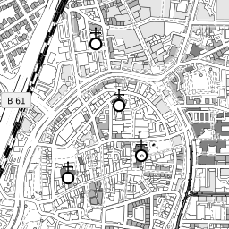

# Whiteprint map

This is an [OpenStreetMap](https://www.openstreetmap.org) map style, created as [CartoCSS](https://github.com/mapbox/carto) map stylesheets. It can be converted to a [Mapnik](https://mapnik.org/) XML using the [carto command](https://cartocss.readthedocs.io/en/latest/installation_usage.html#usage-from-the-command-line).

Its design is inspired by the _Messtischblatt_ or _TK 25_ topographical maps used in Germany, while also containg information useful for a hike. Its primary purpose is to be printed, hence it tries to rely only on black-and-white color.

The implementation is inspired and based on [OpenStreetMap Carto](https://github.com/gravitystorm/openstreetmap-carto) and [OpenStreetMap Carto German](https://github.com/giggls/openstreetmap-carto-de) as well as the [Blueprint style of OpenOrienteeringMap](https://github.com/oobrien/oomap/tree/master), [Stamen's Toner style](https://github.com/geofabrik/toner) and the [Pencil style](https://github.com/openmaptiles/mapbox-studio-pencil.tm2). It was created using [TileMill](https://github.com/tilemill-project/tilemill).

It is available in zoom levels 12--20.
Since the main idea behind the project is to use it to print an actual road map, eg using [Open City Street Map](https://github.com/hholzgra/ocitysmap/) or [OSM-Atlas](https://github.com/openstreetmap/svn-archive/tree/main/applications/rendering/osm-atlas), it may not provide the features usually available from slippy maps.

## PostGIS database requirements

The mapstyle can be used with a database as set up for openstreetmap-carto (named ``gis``), but requires some tweaks (additional indexes).

These are achieved by running

    psql -d gis -f indexes2sql

### Custom indexes

The custom indexes are contained in ``indexes2.sql``.
